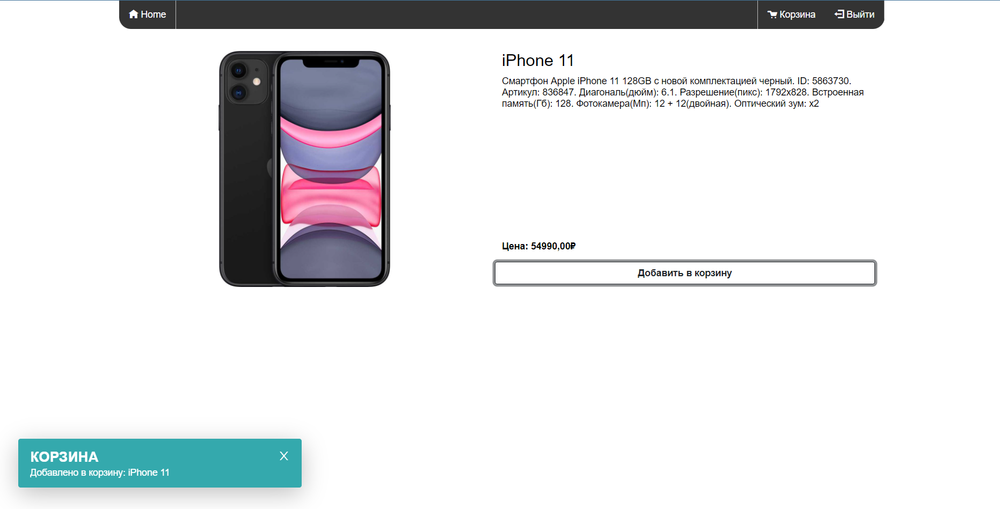
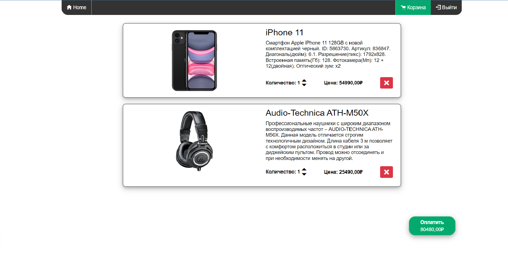
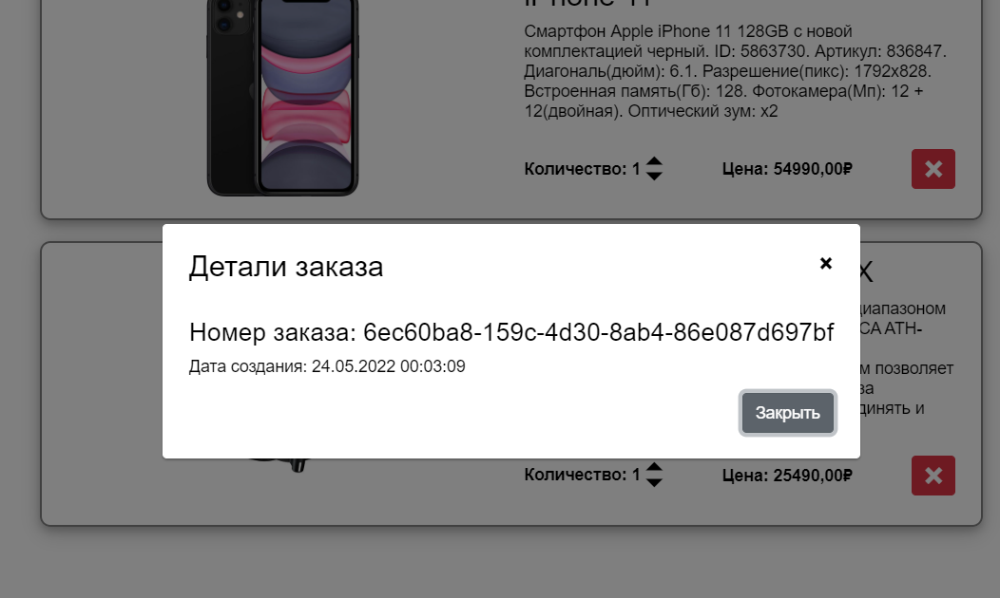

# Диплом на тему: Использование платформы Blazor для создания интерактивных web-приложений.

Целью данной дипломной работы является демонстрирование использования платформы Blazor для создания интерактивных веб-интерфейсов (приложений), используя промышленный подход. 

Нами будет разработано веб-приложение «Интернет магазин», в котором будут использоваться промышленные подходы к разработке. Мы будем использовать принципы программирования SOLID, KISS, DRY, YAGNI. В качестве архитектуры проектирования приложения будет выбрана Onion-архитектура. Для взаимодействия host уровня с application уровнем будет применен паттерн CQRS. Так же мы будем использовать следующие библиотеки: MediatR, AutoMapper, Ardalis.Specification, Blazored и другие. В качестве базы данных выступит SQL Server, а для взаимодействия с ней – Entity Framework Core.

___

## 1. Главная страница.

## 2. Выбор категории.

## 3. Детали товара.

## 4. Корзина.

## 5. Детали заказа.

## 4. Авторизация

## 5. Регистрация.

